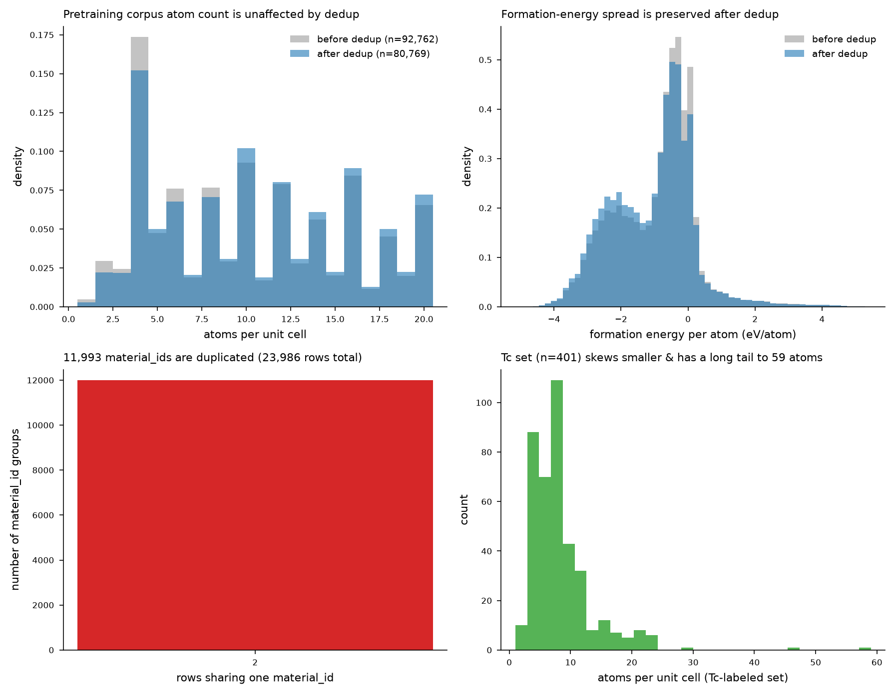
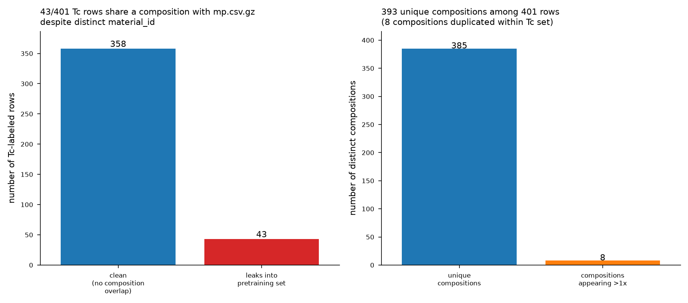
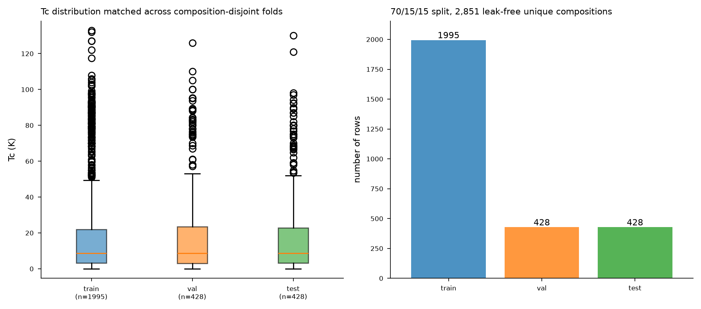

# SUPRA-JEPA Data Audit Report

**Date:** 2026-07-02
**Scope:** Full audit of `data/` for the JEPA pretraining corpus (Materials Project structures) and the Tc-labeled downstream set (SuperBand ∩ Materials Project / 3DSC_MP), followed by cleanup, deduplication, and a rebuilt leak-free train/val/test split.

This report consolidates the findings and actions from the data reorganization pass. Raw analysis artifacts (schema dumps, intermediate CSVs) live in `docs/audit/`; figures referenced below live in `docs/figures/`. The authoritative, up-to-date description of every file under `data/` is `data/MANIFEST.md` — this report explains *why* those files look the way they do.

---

## 1. Inventory and schema audit

`data/` was audited file-by-file (`docs/audit/data_inventory.csv`, `docs/audit/schema_report.json`). Summary of what was found:

| Area | Contents | Status found |
|---|---|---|
| `data/jepa/mp.csv.gz` | Materials Project pretraining corpus (CIF + `ef_per_atom` per `material_id`) | 92,762 rows, **23,986 exact duplicate rows** |
| `data/jepa/mp.csv` | Plaintext copy of the same corpus | Byte-for-byte redundant with the `.gz` — pure disk waste |
| `data/raw/3DSC_MP.csv` | 3DSC_MP reference table (material_id ↔ formula ↔ Tc-adjacent metadata) | 5,773 rows, schema consistent |
| `data/raw/superband.csv` | SuperBand experimental Tc database | 8,625 rows, schema consistent |
| `data/raw/cifs/` | Loose CIF files | 10,904 files, used as fallback structure source |
| `data/raw/3DSC_MP/MP/` | Subdirectory nested under `3DSC_MP/` | Essentially empty (only macOS junk); unused by any script |
| `data/SuperBand/` | Git submodule with local CIFs | Only 32/8,625 SuperBand entries (~0.4%) have a matching local CIF |
| `data/processed/superband_mp_matched.csv` | Unfiltered SuperBand↔MP structure match | 4,013 rows, schema consistent |
| `data/processed/superband_mp_matched_no_train_leak.csv` | "Leak-free" Tc set (old) | 401 rows — **id-only filter, insufficient (see §3)** |
| Everywhere | macOS metadata junk | `.DS_Store` and AppleDouble `._*` files scattered across `data/`, `data/jepa/`, `data/raw/`, `data/raw/3DSC_MP/`, and repo root |

No schema drift or malformed rows were found beyond the duplication and leakage issues detailed below — column names, dtypes, and CIF parseability were consistent within each file.

---

## 2. Duplicate and consistency analysis of the pretraining corpus

`data/jepa/mp.csv.gz` had **92,762 rows but only 80,769 unique `material_id`** — 11,993 duplicate-id groups accounting for 23,986 duplicate rows (≈25.9% of the file).

Every duplicate group was checked for internal consistency before removal: for each group, CIF strings and `ef_per_atom` values were compared across all rows sharing a `material_id`.

| Check | Result |
|---|---|
| Duplicate `material_id` groups | 11,993 |
| Duplicate rows removed (keep-first) | 23,986 |
| Groups with disagreeing CIF or `ef_per_atom` (ambiguous) | **0** |

Every duplicate group was a pure exact repeat — same structure, same formation energy — so keep-first deduplication is lossless with respect to information content. The `dedup_mp_corpus.py` script that performs this includes a hard safety check that raises `ValueError` if any ambiguous group is ever found, so this guarantee is enforced automatically on any future re-run against updated raw data.

Atom-count and `ef_per_atom` distributions were compared before/after dedup, alongside the duplicate-group-size histogram and the Tc-labeled-set atom-count distribution:

| Metric | Before dedup | After dedup |
|---|---|---|
| Rows | 92,762 | 80,769 |
| Unique `material_id` | 80,769 | 80,769 |
| Mean atom count | 10.10 | 10.55 |
| Median atom count | 10 | 10 |
| Std atom count | 5.41 | 5.38 |

The corpus shrinks by ~13% but the atom-count distribution barely shifts (duplicates were not concentrated in any particular structure-size range), so the deduplicated corpus is not biased relative to the original by this measure.

---

## 3. Composition-level leakage analysis (pretraining ↔ Tc-labeled set)

The existing "leak-free" Tc file, `data/processed/superband_mp_matched_no_train_leak.csv` (401 rows), was built by keeping only rows whose `mp_material_id` does **not** appear in `mp.csv.gz` — an exact-id filter.

This filter has a structural gap: a JEPA encoder pretrained on composition X does not need to see the *exact same* `material_id` as a downstream Tc example to have already learned that composition's structure — it only needs to have seen **any polymorph or relaxation of the same composition** during pretraining. Exact-id filtering cannot catch that.

To check this, every CIF in both the pretraining corpus and the Tc-matched set was re-parsed via `pymatgen.core.Composition.fractional_composition` to derive a normalized composition key (independent of the raw formula-string columns, which were found to occasionally disagree with the CIF itself — e.g. doped vs. undoped formula strings for the same structure).

| Check on old 401-row "no-leak" file | Result |
|---|---|
| Rows leaking by composition under a *different* `material_id` | **43 / 401 (10.7%)** |
| Duplicate compositions within the 401 rows | 8 |

**Conclusion: the old id-only filter let 10.7% of its "clean" rows leak.** This motivated rebuilding the split from scratch using composition-level filtering (§5), applied to the full 4,013-row unfiltered match pool rather than to the already-filtered 401-row file.

---

## 4. Pretraining corpus deduplication (action taken)

`scripts/dedup_mp_corpus.py` was run against `data/jepa/mp.csv.gz`, applying keep-first-per-`material_id` deduplication with the ambiguity safety check described in §2.

- `data/jepa/mp.csv.gz` was overwritten in place: **92,762 → 80,769 rows**.
- The redundant plaintext duplicate `data/jepa/mp.csv` was deleted (the `.gz` is now the single source of truth for the pretraining corpus).
- `crystal_matrices.py` (`SuperconductorDataset.__init__`, `create_dataloader`) now defaults `deduplicate=True` (was `False`), so any future load of a not-yet-deduplicated CSV is deduplicated defensively at load time.
- `train_sc_jepa.py`'s CLI flag was changed from an opt-in `--deduplicate` to an opt-out `--no-deduplicate`, matching the new default.
- Full report: `data/processed/mp_dedup_report.json`.

---

## 5. Rebuilt leak-free Tc train/val/test split

`scripts/build_tc_splits.py` rebuilds the Tc-labeled split from the **full, unfiltered** `data/processed/superband_mp_matched.csv` (4,013 rows) using composition-level leakage filtering:

1. Recompute each row's composition from **its own CIF's** `_chemical_formula_sum` (not the SuperBand formula-string column — these can disagree, e.g. doped vs. undoped formulas for nominally the same material).
2. Drop any row whose composition appears anywhere in the deduplicated pretraining corpus (`mp.csv.gz`): **1,155 / 4,013 rows removed (28.8%)**.
3. Deduplicate remaining rows by composition, keeping the first by `superband_id`: **7 more rows removed**, leaving **2,851 unique leak-free compositions**.
4. Split 70% / 15% / 15% stratified by `log10(Tc)` decile (`sklearn.model_selection.train_test_split`, seed 42).
5. Programmatically verify composition sets are fully disjoint across all three folds — verified `True`.

| Fold | Rows | Mean Tc (K) | Median Tc (K) | Std Tc (K) |
|---|---|---|---|---|
| `tc_train.csv` | 1,995 | 18.21 | 8.77 | 23.45 |
| `tc_val.csv` | 428 | 18.43 | 8.73 | 23.80 |
| `tc_test.csv` | 428 | 17.78 | 8.70 | 22.52 |

Tc distributions are closely matched across folds (stratification worked as intended):

`data/processed/pretrain_exclusion_list.csv` is emitted for completeness but is correctly **empty (0 rows)**: since leak filtering already removes every pretraining-overlapping composition *before* the split is built, there is nothing left in `mp.csv.gz` to additionally exclude. This is expected behavior, not a bug — if the pretraining corpus is ever regenerated from a newer Materials Project snapshot, re-running this script against the new corpus is the correct way to regenerate a matching exclusion list.

This new split is a **~7x larger usable Tc-labeled dataset** than the old 401-row file (2,851 vs. 393 unique clean compositions) while fixing the composition-leak gap identified in §3.

Full stats: `data/processed/tc_split_report.json`.

---

## 6. Before / after summary

| Item | Before | After |
|---|---|---|
| Pretraining corpus format | `mp.csv.gz` **and** redundant plaintext `mp.csv` | `mp.csv.gz` only |
| Pretraining corpus rows | 92,762 (23,986 exact duplicates) | 80,769 (deduplicated, 0 ambiguous) |
| Deduplication default in code | Off (`deduplicate=False`) | **On** (`deduplicate=True`), defensive at load time |
| Tc-labeled "clean" set | 401 rows, id-only filter, **43 rows (10.7%) leaking by composition** | 2,851 rows, composition-level filter, **verified 0 leakage** |
| Tc split | None (single flat file) | `tc_train.csv` / `tc_val.csv` / `tc_test.csv`, 70/15/15, stratified by Tc decile, composition-disjoint |
| Superseded Tc-filter files | Lived in `data/processed/` alongside current files | Removed (were briefly archived to `data/processed/legacy/`, then deleted outright — unreferenced by any script, rationale kept in `MANIFEST.md`) |
| Empty unused subdirectory | `data/raw/3DSC_MP/MP/` (only macOS junk) | Removed |
| macOS junk (`.DS_Store`, `._*`) | Scattered across repo root and `data/` subtree | Removed; `.gitignore` updated to prevent recurrence |
| Data documentation | None | `data/MANIFEST.md` (schema/rowcount/provenance per file) + this report |

---

## 7. End-to-end validation

- `pytest tests/` → **38 passed**, 0 failed, after all code and data changes.
- Smoke test: `create_dataloader(csv_path="data/jepa/mp.csv.gz")` (deduplication on by default) → dataset size confirmed **80,769** (matches the deduplicated row count on disk) → `build_model(regularizer="vc", reg_weight=0.01)` → one `train_one_step` call completed successfully with finite, non-degenerate losses (`loss=1.98`, `loss_pred=1.97`, `reg_std_loss=0.94`, `reg_cov_loss≈2.7e-6`), confirming the training pipeline runs correctly end-to-end against the cleaned corpus.

---

## 8. Known limitations (carried into `data/MANIFEST.md`)

- **SuperBand local CIF coverage is only ~0.4%** (32/8,625 entries); the overwhelming majority of matched structures use a 3DSC_MP-sourced CIF as a structural proxy rather than a SuperBand-native structure. This is a pre-existing property of the raw data, not something this audit introduced or could fix.
- **Composition-level leak filtering is polymorph-blind by construction** — it treats two different CIFs of the same composition as identical for leakage purposes, which is the intended conservative behavior here (a JEPA encoder that has seen one polymorph likely has *some* transferable representation of that composition), but it also means the filter is strictly more aggressive than an id-level filter; if this is judged too strict in the future, an id+space-group-level filter is a reasonable relaxation to consider.
- **~2,000 Tc-labeled training rows is still small** for a downstream regression head, even though it is ~5x larger than before. The existing recommendation to favor k-fold cross-validation and/or a low-capacity regression head on top of frozen JEPA embeddings (rather than full fine-tuning of the 512-dim transformer) still applies.

---

## 9. Stage-2 property corpus addendum (2026-07-03)

After the first data cleanup, the repo was extended for the second model
stage: a property-JEPA trained on crystal structure plus sparse scalar
material-property labels. The detailed audit for that corpus is
`docs/property_jepa_data_audit_report.md`; this addendum records the headline
changes so this report remains a useful entry point.

New raw sources:

| Source | Rows | Main contribution |
|---|---:|---|
| JARVIS-DFT `dft_3d` | 93,902 | OptB88vdW/TBmBJ/HSE06 electronic gaps, magnetic moments, mechanical properties, DFT-predicted Tc. |
| Alexandria PBEsol 3D-all | 415,419 | Uniform PBEsol thermo, electronic, DOS-at-Fermi, and magnetic scale-up. |

The four-source consolidation (SuperBand, Materials Project, JARVIS-DFT,
Alexandria PBEsol) produced `data/processed/consolidated_properties.csv.gz`
with **312,149 unique compositions**. Splits for property-JEPA are:

| Split | Rows | Leakage guarantee |
|---|---:|---|
| `property_jepa_train.csv.gz` | 249,719 | May include MP-pretraining compositions, train only. |
| `property_jepa_val.csv.gz` | 31,215 | 0 compositions overlapping MP pretraining or train/test. |
| `property_jepa_test.csv.gz` | 31,215 | 0 compositions overlapping MP pretraining or train/val. |

Important modeling caveats:

- The table intentionally keeps per-source columns because it mixes
  OptB88vdW/TBmBJ/HSE06, PBEsol, Materials Project PBE/PBE+U, and
  experimental measurements. The "best available" columns are convenience
  fields, not a physically uniform level of theory.
- Mechanical labels remain JARVIS-only and sparse (~6-7% coverage).
- Experimental Tc remains very sparse: 3,964 compositions, about 1.27% of
  the consolidated corpus.
- Stage-2 batching therefore uses masks and variable known/query property
  sets rather than assuming a dense property matrix.

The stage-2 code that consumes these files lives in `models/property_jepa/`;
the architecture rationale and open design questions are documented in
`docs/property_jepa_design.md`.

---

## Reproducing this audit

- Pretraining dedup: `python scripts/dedup_mp_corpus.py`
- Tc split rebuild: `python scripts/build_tc_splits.py`
- Both scripts are idempotent and safe to re-run against updated raw data; both include hard assertions that fail loudly (rather than silently producing a wrong split) if the ambiguity or disjointness invariants are ever violated.
